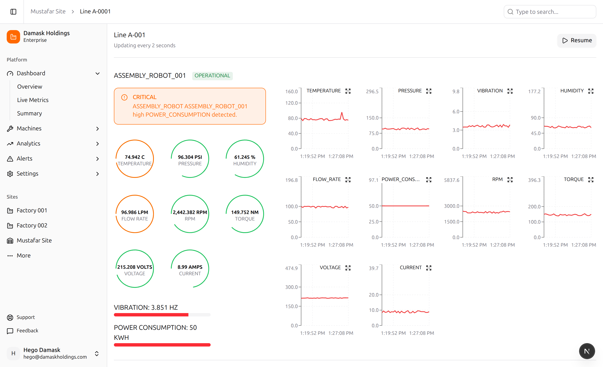

# Industrial IoT Telemetry Dashboard

A real-time manufacturing telemetry dashboard built with **Next.js**, **TypeScript**, and **Vercel**.  
Simulates how aerospace and industrial SaaS platforms monitor machine health across a production line.

---

## ✨ Features

- **Live Telemetry Simulation**  
  Machines broadcast data every second (temperature, vibration, torque, RPM, etc.), updating gauges + charts in real time.

- **Rolling 30s Line Charts**  
  Each sensor shows the last 30 seconds of readings, providing a short-term historical view of machine health.

- **Machine States**  
  Machines can be `Operational`, `Idle`, `Maintenance`, `Faulty`, or `Offline` with automatic color-coded alerts.

- **Multi-Machine Support**  
  The dashboard tracks multiple machines simultaneously across a factory line.

- **Portfolio-Ready Simulation**  
  All telemetry is dummy data, generated client-side. No external brokers or APIs required.

---

## 🖼️ Demo Screenshot

---

## 🛠️ Tech Stack

- **Frontend:** Next.js (React, TypeScript)
- **UI:** Shadcn, TailwindCSS
- **Data Simulation:** In-browser random telemetry generator
- **Charts:** Recharts
- **Deployment:** Vercel

---

## 🚀 Why This Project

This project demonstrates **real-time event handling, time-series data visualization, and SaaS-ready UI design** — skills directly relevant to aerospace, defense, and industrial software engineering.

It’s inspired by industrial IoT use cases such as:
- Monitoring factory robots and CNC machines  
- Tracking power consumption and vibration for predictive maintenance  
- Visualizing operational health across multiple production lines  

